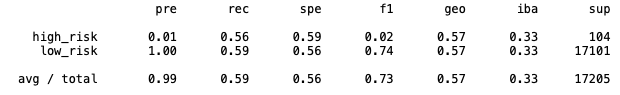
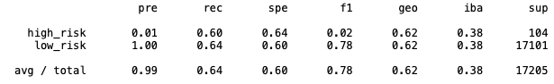
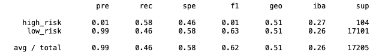
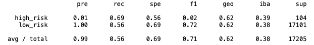
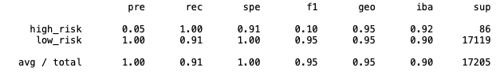
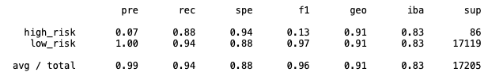

# Credit_Risk_Analysis
# Christopher Padilla Gregorio

# Overview 
  The purpose of this assignment to predict the credit risk for a credit card credit dataset from LendingClub. The alanyize the risk of credit card risk serval algorithms will be preformed. Such as RandomOverSampler, SMOTE, ClusterCentroids, BalancedRandomForestCluster and EasyEnsembleClassifier. After these analysis predictor have been completed, a evaluation of each algorithm will be done. 
  
# Results 
  1. The naive random oversampling and the SMOTE oversampling both contain a precision score of 1.00 for low risk credit and 0.01 precision score for high risk credit. However, the SMOTE oversampling contians a higher recall and F1 score
  2. The undersampling algorithm contains the same high risk precision score as oversampling. Though, undersampling has a slightly lower low risk credit precision score at 0.99. 
  3. The combination of over and under sampling does not show much variation 
  4. The balance random forest classifer contains a score across the board, with recall score between 0.90 to 1.00, F1 score being 0.95 for low risk credit and a high risk credit precision score of 0.05 
  5. The adaboost classifer has the highest precision score for high risk credit cards at 0.07
  
  Naive Random OverSampling 
  
  
  
  SMOTE Oversampling
  
  
  
  Undersampling
  
  
  
  Combination
  
  
  
  Balance Random Forest Classifer
  
  
  
  Easy Ensemble AdaBoost Classifier
  
  
  
# Summary 
  Over all each of the models contained the same pattern that the high risk credit cards had a lower score across the board than the low risk credit cards. Though, out of the 6 models analyized, the Easy Ensemble AdaBoost Classifer had a greater variation between the low and high risk credit cards. The other five models were too similar in its statistics that it's jufficiation may be slightly more difficult to determine if it may be best model or not. 
